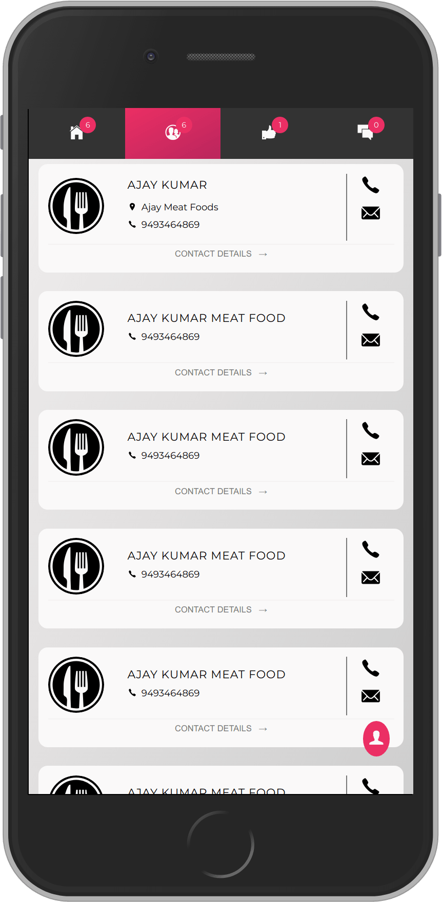
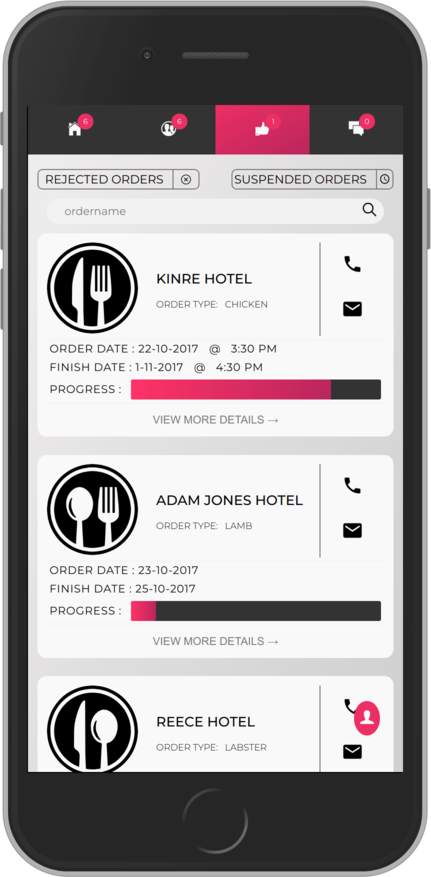
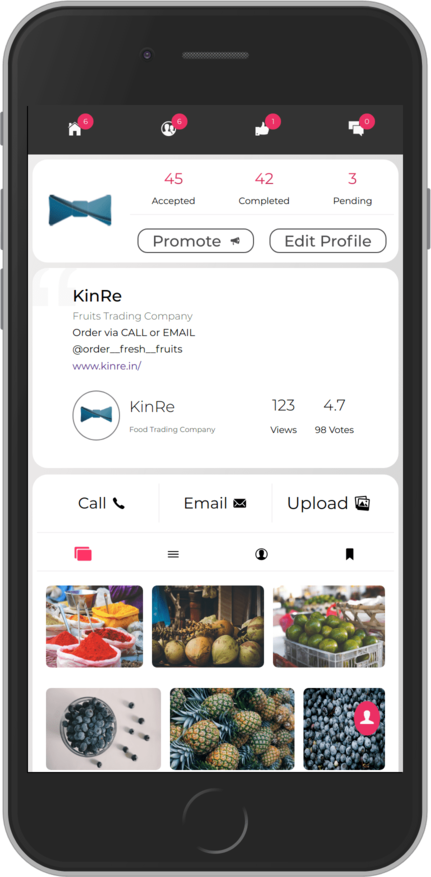
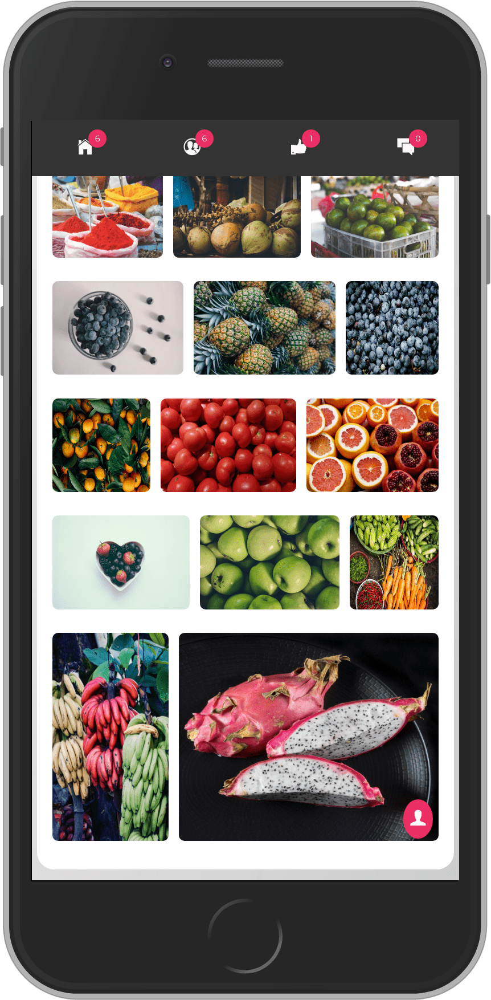

#KinRe Vendor Application
###### Not the full version.

### This are the developed screenshots everything from scratch.

##### Developed in 
- HTML5
- CSS3
- SASS (css preprocessor)
- JavaScript (ES 6)

This web application is developed without using any third party libraries even jQuery and Bootstrap.

##### Developed Screen Shots
###### KinRe Vendor Home

 
 This tab shows the requests raised by the restaurant's based on their requirements, so vendors can accept the request and trade the goods.
 ###### KinRe Vendor Contacts
 
 
 This tab shows the contacts of the restaurant's that user has previously served/traded goods.
 ###### KinRe Vendor Orders
 
 
 This tab shows to orders accepted by the vendor and their due-data and progress.
 ###### KinRe Vendor Profile
 
 
 This tab shows the profile of the vendor.
 ###### KinRe Vendor Gallery
 
 
 This shows the vendors gallery used in KinRe Feeds application.  
