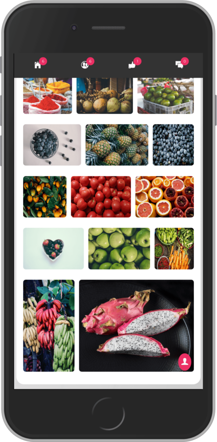

#KinRe Vendor Application

### This are the developed screen shots everything from scratch.

##### Developed in 
- HTML5
- CSS3
- SASS (css preprocessor)
- JavaScript (ES 6)

This web application is developed with out using any third party libraries even jQuery and Bootstrap.

##### Developed Screen Shots
###### KinRe Vendor Home

 
 This tab shows the requests raised by the restaurant's based on their requirements, so vendors can accept the request and trade the goods.
 
 
 
 This tab shows the contacts of the restaurant's that user has previously served/traded goods.
 
 
 
 This tab shows to orders accepted by the vendor and their due-data and progress.
 
 
 
 This tab shows the profile of the vendor.
 
 
 
 This shows the vendors gallery used in KinRe Feeds application.  
